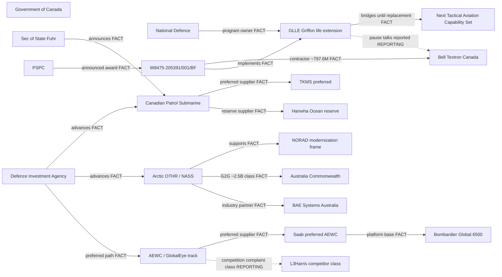

# Defence procurement velocity cluster — Mermaid companion

Public-safe topology from `defence_cluster_network.json`.  
**Preferred supplier ≠ signed multi-year production contract.** Centrality is documentation density, not guilt.

## Dollar classes (public freezes)

| Instrument | Class |
|------------|--------|
| GLLE contract W8475 | CAD 797,556,147 |
| Arctic OTHR Australia path | CAD 2.5B class |
| CPSP | preferred TKMS; reserve Hanwha; contract target by 2027 |

## Claim levels

- Solid edges = **FACT** government instruments  
- Dashed edges = **REPORTING** (pause talks / competition class)

Source freezes: PSPC news, CanadaBuys, DCB, DIA releases. Updated with the investigation desk freezes of 2026-07-11.
