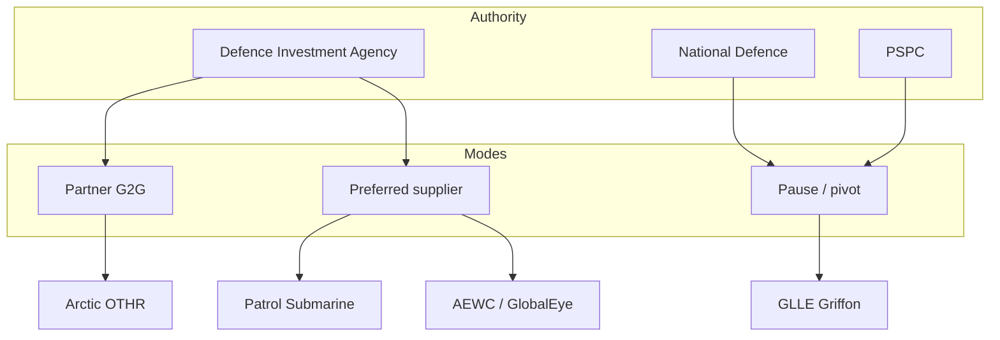
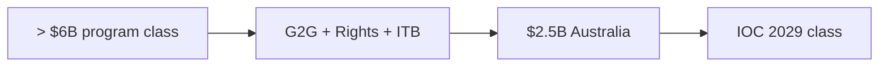
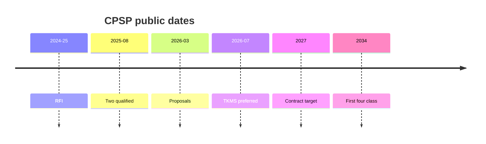
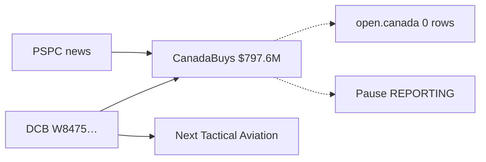
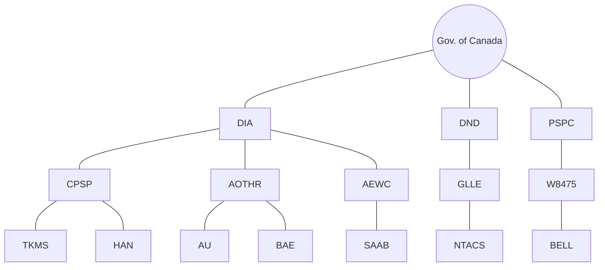

# Intelligence Briefing — Defence Procurement Velocity Cluster  
### Expanded analysis edition

**Filed:** 2026-07-11 · **Desk:** TENET5 investigation  
**Threat level:** AMBER  
**Standard:** FACT / REPORTING / INFERENCE labeled. Inclusion is not a criminal finding.  
**Machine network:** `data/analysis/defence_cluster_network.json`  
**Data science summary:** `data/analysis/defence_cluster_datascience_last.json`  
**Mermaid library:** `data/analysis/defence_cluster_mermaid.md`

---

## Executive situation

Canada’s public defence-procurement surface is moving in **three modes at once**:

1. **Partner acceleration** — Arctic OTHR via Australia / BAE (G2G).  
2. **Preferred-supplier compression** — CPSP (TKMS) and AEWC (Saab).  
3. **Pause / pivot** — Griffon GLLE under a named contract while official pages lag and replacement language already exists in the Defence Capabilities Blueprint.

The investigative core is not whether capabilities are needed. It is whether **instruments, dollars, schedules, and disclosure** keep pace with political spending rhetoric — and whether the public can follow the chain without ATIP.

---

## Key numbers (do not sum into one “total”)

| Instrument | Class | Level |
|------------|-------|--------|
| GLLE contract W8475-205391/001/BF | **CAD 797,556,147** | FACT (CanadaBuys + DCB) |
| A-OTHR spend with Australia | **$2.5 billion** | FACT (DIA 2026-06-22) |
| A-OTHR program | **more than $6 billion** | FACT (PM class via DIA quick facts) |
| CPSP hulls | **up to 12** | FACT |
| CPSP first four | **2034** | FACT (backgrounder) |
| CPSP contract target | **by end of 2027** | FACT (backgrounder) |
| GLLE paid-to-date | **unknown** | NULL |
| open.canada rows for W8475-205391 | **0** | FACT search result |

---

## Cluster map

---

## Point I — Arctic OTHR (partner acceleration)

**Status:** Delivery phase (government language).  
**Mode:** G2G + industry partner.

### Established (FACT)

- Stage 1 sites: Kawartha Lakes transmit (163 ha); Clearview preliminary receive (288 ha). Public consultation 2025.  
  Source: [DND A-OTHR page](https://www.canada.ca/en/department-national-defence/services/operations/allies-partners/norad/aothr.html)  
- 22 June 2026: Fuhr–Marles G2G Acquisition Arrangement; OTHR Rights Agreement; ITB with BAE Systems Australia.  
- Canada committed to spend **$2.5 billion** with Australia; BAE work start **1 July 2026**; IOC class **December 2029**.  
- Program class **more than $6 billion** (March 2025 PM announcement, restated in DIA release).  
  Source: [DIA 2026-06-22](https://www.canada.ca/en/defence-investment-agency/news/2026/06/canada-advances-arctic-defence-on-over-the-horizon-radar-capability-through-partnership-with-australia.html)

### Analytical note (INFERENCE)

This is not a silent commercial sole-source RFP story. It is a **partner path with published dollar classes**. The accountability questions are industrial benefits delivery, siting fairness, and schedule honesty — not whether a competition poster existed.

---

## Point II — Canadian Patrol Submarine (compressed preferred supplier)

**Status:** Preferred supplier selected; negotiations open.  
**Mode:** Two-supplier shortlist → preferred in under eight months (government language).

### Established (FACT)

- **6 July 2026:** Thyssenkrupp Marine Systems (**TKMS**) preferred supplier for up to **12** submarines.  
- **Hanwha Ocean** designated **Reserve Supplier**.  
- Contracting no later than **end of 2027**; first **four** deliveries **2034**.  
- Process: RFI 2024–25 → two qualified **26 Aug 2025** → proposals **Mar 2026** → preferred **6 Jul 2026**.  
  Sources: [DIA speech](https://www.canada.ca/en/defence-investment-agency/news/2026/07/government-of-canada-advances-canadian-patrol-submarine-project.html) · [Backgrounder](https://www.canada.ca/en/defence-investment-agency/news/2026/07/backgrounder-government-of-canada-advances-canadian-patrol-submarine-project.html)

### Analytical note (INFERENCE)

Compression is **owned language**, not only outsider critique. Preferred supplier ≠ signed production contract. The next public test is cost envelope, ITB, and whether the reserve path is real leverage or theatre.

---

## Point III — AEWC / GlobalEye (preferred supplier, no contract yet)

### Established (FACT)

- **27 May 2026:** Canada enters discussions with **Saab** as preferred supplier for AEWC.  
- Backgrounder: preferred supplier **does not constitute a contractual commitment**.  
- Platform class: **Bombardier Global 6500**.  
  Sources: [DIA preferred supplier](https://www.canada.ca/en/defence-investment-agency/news/2026/05/the-government-of-canada-selects-preferred-supplier-for-airborne-early-warning-and-control-discussions.html) · [Backgrounder](https://www.canada.ca/en/defence-investment-agency/news/2026/05/backgrounder-canada-is-strengthening-defence-sovereignty-and-industrial-capacity-through-investments-and-partnerships.html)

### REPORTING

- L3Harris competition-complaint framing in secondary coverage.  
  Source: [CBC](https://www.cbc.ca/news/politics/globaleye-aeris-x-canada-saab-sweden-9.7247534)

---

## Point IV — GLLE Griffon (named contract + pause + disclosure gap)

### Established (FACT)

| Item | Detail |
|------|--------|
| Contract | **W8475-205391/001/BF** |
| Value | **CAD 797,556,147** |
| Award news | PSPC **30 May 2022**, nearly $800M, Bell Textron Canada Limited |
| DCB | Project **2526**; award class **April 2021** (date conflict with news) |
| Replacement bridge | DCB objective: bridge until **Next Tactical Aviation Capability Set** |
| DCB schedule class | Initial delivery **2029/2030**; final **2032/2033** (page mod 2025-12-01) |
| open.canada | Search `W8475-205391` → **0 records** (2026-07-11) |
| Official project page | Still Phase 3 / FOC 2027 / details **2020-12-02** |

Sources: [PSPC EN](https://www.canada.ca/en/public-services-procurement/news/2022/05/government-of-canada-announces-contract-to-extend-life-of-royal-canadian-air-force-fleet-of-85ch146-griffon-helicopters.html) · [DCB 2526](https://apps.forces.gc.ca/en/defence-capabilities-blueprint/project-details.asp?id=2526) · [CanadaBuys](https://canadabuys.canada.ca/en/tender-opportunities/contract-history/w8475-205391/001/bf-001) · [DND project page](https://www.canada.ca/en/department-national-defence/services/procurement/ch-146-griffon.html)

### REPORTING

- June 2026 pause; DND spokesperson cites cost, schedule, complexity, and **replacement fleet planning**.  
  Source: [CBC 2026-06-27](https://www.cbc.ca/news/politics/airforce-helicopters-griffon-upgrade-suspended-9.7250616)

### Analytical note (INFERENCE)

Replacement language is **not invented by the pause**. DCB already frames GLLE as a bridge to the next tactical aviation set. The pause converts that latent bridge into a live political and industrial question. The disclosure gap — award public, open.canada empty — is itself a finding about the record, not about flightworthiness.

---

## Data science read (heuristics — INFERENCE)

From `defence_cluster_datascience_last.json`:

| Point | Compression index | Transparency index |
|-------|-------------------|--------------------|
| CPSP | 0.85 | 0.40 |
| AEWC | 0.75 | 0.35 |
| A-OTHR | 0.70 | 0.70 |
| GLLE | 0.55 | 0.50 |

**Read:** Compression is highest where preferred-supplier paths are shortest. Transparency is highest where dollars and partners are named (A-OTHR) and weakest where preferred status exists without instrument dollars (AEWC). GLLE sits in the middle: strong instrument identity, weak proactive disclosure and paid-to-date.

**Do not** treat these scores as scientific constants. They are ranking tools for the desk.

---

## Connection graph (entity)

Full edge list with URLs: `data/analysis/defence_cluster_network.json`.

---

## Open research queue

1. Paid-to-date and amendments on **W8475-205391/001/BF** (ATIP E ready).  
2. Reconcile DCB **April 2021** vs PSPC **May 2022** award dates.  
3. Freeze **Next Tactical Aviation Capability Set** DCB page when located.  
4. CPSP negotiation cost envelope when published.  
5. AEWC contract if/when signed (preferred ≠ contract).

---

## Publisher handoff

| Asset | Path |
|-------|------|
| This briefing | `data/intelligence_briefs/defence_cluster_expanded_briefing_20260711.md` |
| Mermaid pack | `data/analysis/defence_cluster_mermaid.md` |
| Network JSON | `data/analysis/defence_cluster_network.json` |
| Datascience | `data/analysis/defence_cluster_datascience_last.json` |
| Ship tables | `data/osint_laps/publisher_content_pack_defence_lap4_2026-07-11.md` |

**Gate:** press build → theme → site duty → push → live browser verify.  
**Taste:** ice / void / glass; newsroom English; one figure per fold; no cyber HUD.

---

## Seal

**DEFENCE_CLUSTER_EXPANDED_BRIEFING_SHIPPED** · FACT-heavy · graphs elegant · analysis ready for Claude publish lane.
